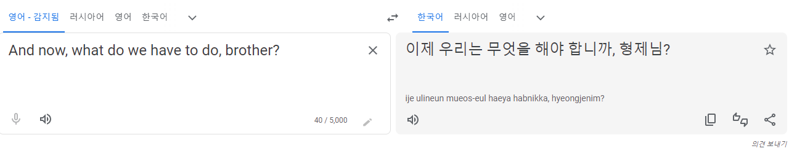
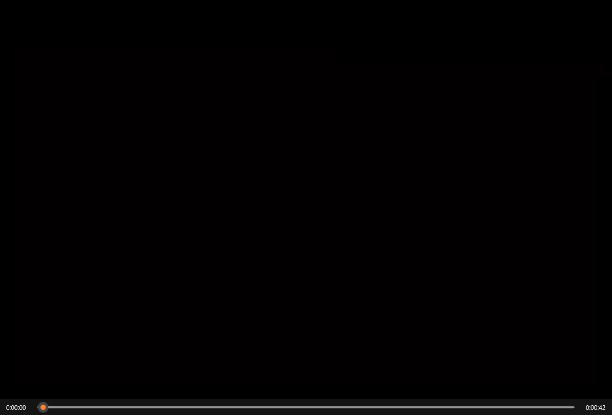
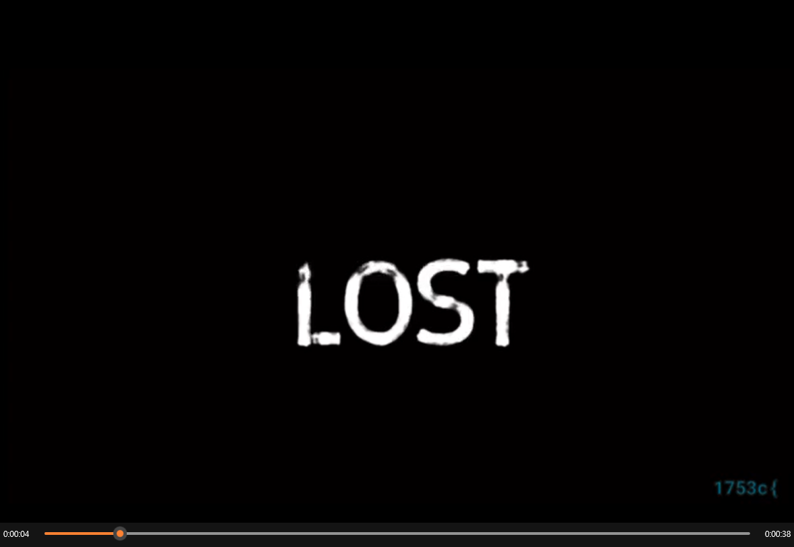
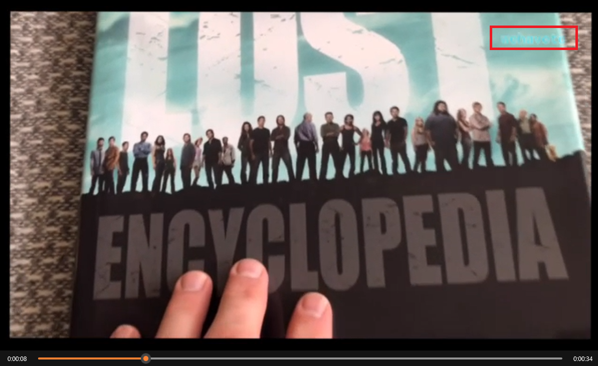
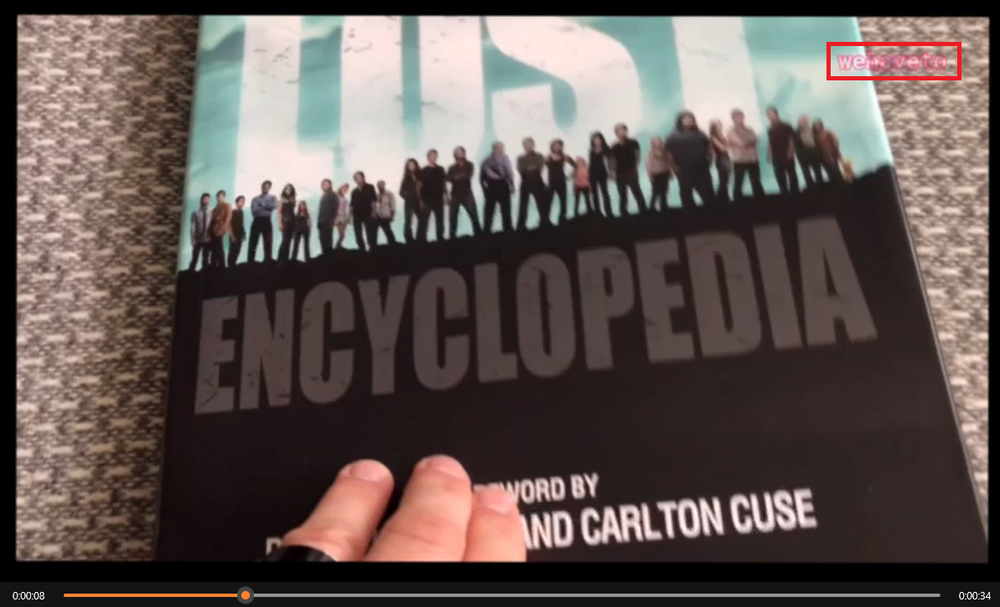
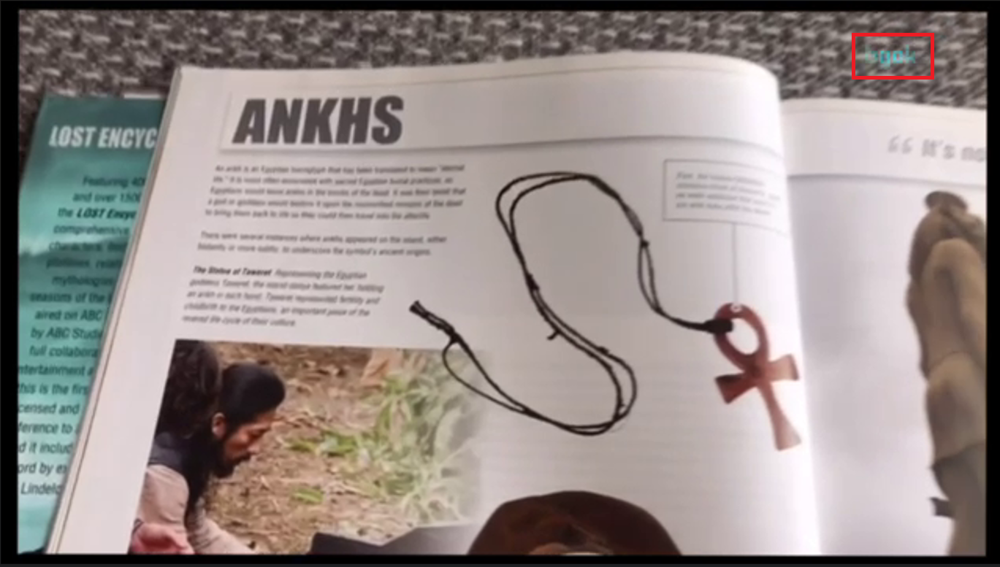
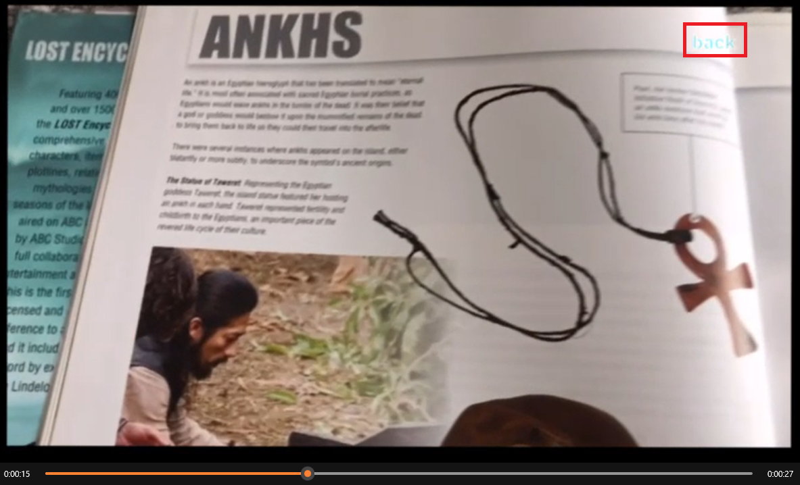
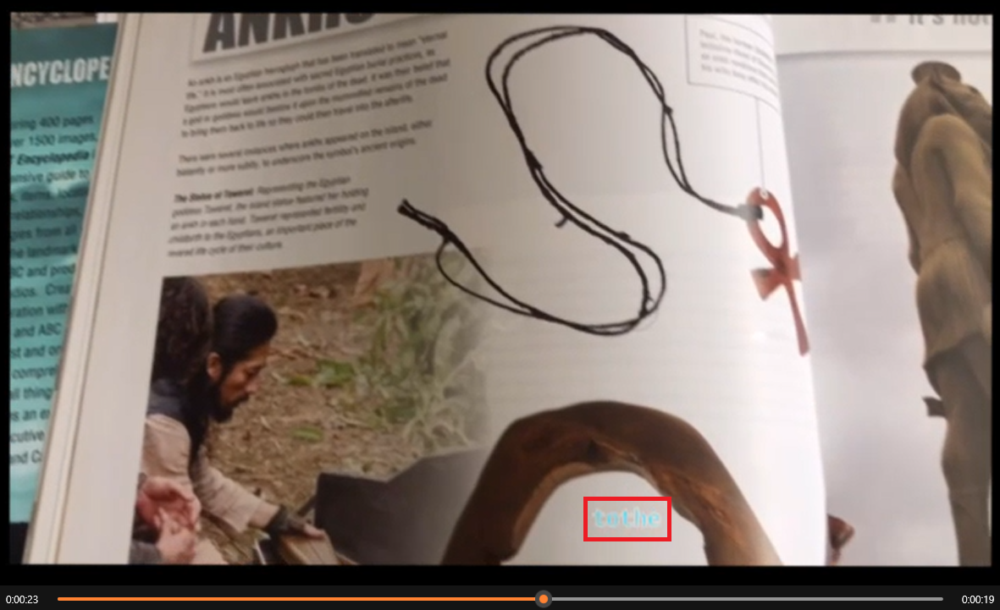
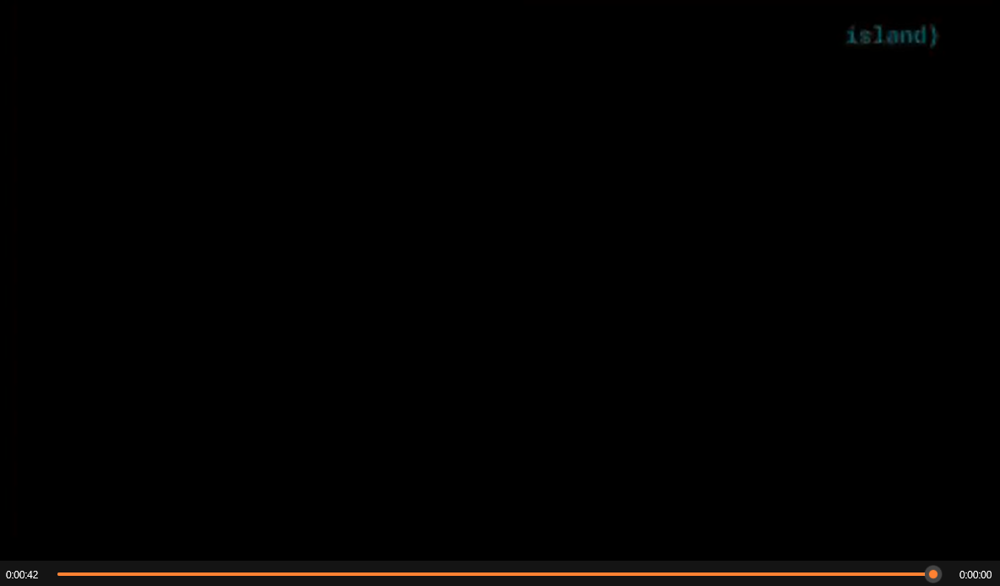

# [STEGANO] The Constant


>   

---
## 파일 다운로드 링크
>   Link : https://dl.1753ctf.com/stegano/S1E18.mov?s=ZXR3b04c (파일 공유 중단)
---

## 문제 풀이 
### Time : 00:01 ~ 00:02 
>   

* Monochrome(단색) Screen의 경우 글자를 표시할 수 있는 방법이 여러가지가 존재함
    1) Black Screen에서 화면 전환이 되는 짧은시간에 작성된 글자
    2) Black Screen에 검은색 글씨로 작성되었을 수 있음 
---
### Time : 00:03 ~ 00:04
>   

* 오른쪽 하단에 `1753c{` 라는 문구가 존재함
    * `1753c{` 문구는 이번 CTF의 FLAG 구문 
    * ex) `1753c{test_task_one_secret_flag}`
---
### Time : 00:04 ~ 00:05
>   

* Noise Scrren도 역시 Monochrome 처럼 여러 데이터를 넣을 수 있음
    *   단순 Noise로 보일 수 있으나, 프레임단위로 분할해서 보면 유의미한 데이터가 존재할 수 있음
---
### Time : 00:05 ~ 00:06
>   

* 오른쪽 상단에 어떠한 글자가 존재하는 것을 확인할 수 있으나, 명확하지 않음

>   

* 글자에 테두리(빨간색)가 적용되면서 `wehaveto` 라는 글자를 확인할 수 있음 
---
### Time : 00:15
>   

* 15초 부근에도 어떠한 글자가 있는 것을 확인할 수 있으나 명확하지 않음
    * 대략적으로 보이는 글자는 `gok`로 보이지만 다음화면(00:16) 의 연속으로 헷갈릴 수 있음
---
### Time : 00:16
>   

* 16초에 `back` 이라는 글자가 명확하게 보임.  
---
### Time : 00:23 ~ 00:24
>   

* 23초에 하얀색 화면에 있어서 명확하게 보이지는 않지만, 글자가 존재함
    *   `tothe`로 추정
---
### Time : 00:42
>   

* 화면이 종료되는 42초 부근 오른쪽 상단에 `island}` 라는 데이터를 확인할 수 있음 
---

## Flag 정리 및 추측 
>   00:03 ~ 00:04 =` 1753c`
>
>   00:08 ~ 00:09 = `wehaveto`
>
>   00:15 ~ 00:15 = `gok`
>
>   00:16 ~ 00:16 = `back`
>
>   00:23 ~ 00:24 = `tothe`
>
>   00:42 ~ 00:42 = `island}`

* `1753c` 와 island의 `}`을 빼서 문장으로 합치면 아래와 같음
    * `we have to gok back to the island`
    * 여기서 한가지 문법상 오류가 있음 
    * 대략적으로 이 구문에 대해 해석해보자면 
        * "우리는 섬으로 되돌아 가야 한다" 의 의미로 보여지지만
        * `gok` 라는 것이 `gok`가 아닌 `go`로 봐야한다는 것 
        * 화면에서 되게 빠른 시간안에 `go`가 `back`로 변경되면서 `back`의 `k`가 붙여진 것처럼 보일 수 있는 착시가 존재 
        * 이렇게 착시 혹은 사람이 확인하기 어려운 화면에 대해서 영상을 Frame 단위로 쪼개서 확인해야 함  

## 영상 분할(Frame)
### Python Code
```
from stegano import lsb
from os.path import isfile,join

import time                                                                 #install time ,opencv,numpy modules
import cv2
import numpy as np
import math
import os
import shutil
from subprocess import call,STDOUT

def split_string(s_str,count=10):
    per_c=math.ceil(len(s_str)/count)
    c_cout=0
    out_str=''
    split_list=[]
    for s in s_str:
        out_str+=s
        c_cout+=1
        if c_cout == per_c:
            split_list.append(out_str)
            out_str=''
            c_cout=0
    if c_cout!=0:
        split_list.append(out_str)
    return split_list

def frame_extraction(video):
    if not os.path.exists("./tmp"):
        os.makedirs("tmp")
    temp_folder="./tmp"
    print("[INFO] tmp directory is created")

    vidcap = cv2.VideoCapture(video)
    count = 0
    while True:
        success, image = vidcap.read()
        if not success:
            break
        cv2.imwrite(os.path.join(temp_folder, "{:d}.png".format(count)), image)
        count += 1

def encode_string(input_string,root="./tmp/"):
    split_string_list=split_string(input_string)
    for i in range(0,len(split_string_list)):
        f_name="{}{}.png".format(root,i)
        secret_enc=lsb.hide(f_name,split_string_list[i])
        secret_enc.save(f_name)
        print("[INFO] frame {} holds {}".format(f_name,split_string_list[i]))
def decode_string(video):
    frame_extraction(video)
    print(video)
    secret=[]
    root="./tmp/"
    for i in range(len(os.listdir(root))):
        f_name="{}{}.png".format(root,i)
        secret_dec=lsb.reveal(f_name)
        if secret_dec == None:
            break
        secret.append(secret_dec)
    
    print(2)
    print(''.join([i for i in secret]))
    #clean_tmp()
def clean_tmp(path="./tmp"):
    if os.path.exists(path):
        shutil.rmtree(path)
        print("[INFO] tmp files are cleaned up")

def main():
    input_string = input("Enter the input string :")
    f_name=input("enter the name of video")
    frame_extraction(f_name)
    call(["ffmpeg", "-i",f_name, "-q:a", "0", "-map", "a", "tmp/audio.mp3", "-y"],stdout=open(os.devnull, "w"), stderr=STDOUT)
    
    encode_string(input_string)
    call(["ffmpeg", "-i", "tmp/%d.png" , "-vcodec", "png", "tmp/video.mov", "-y"],stdout=open(os.devnull, "w"), stderr=STDOUT)
    
    call(["ffmpeg", "-i", "tmp/video.mov", "-i", "tmp/audio.mp3", "-codec", "copy", "video.mov", "-y"],stdout=open(os.devnull, "w"), stderr=STDOUT)
    clean_tmp()
if __name__ == "__main__":
    while True:
        print("1.Hide a message in video 2.Reveal the secret from video")
        print("any other value to exit")
        choice = input()
        if choice == '1':
            main()
        elif choice == '2':
            decode_string(input("enter the name of video with extension"))
        else:
            break
```

## 프레임 분석 
* 영상은 42초이며, 프레임으로 분리된 파일의 개수는 1,273개
    * 1273 / 42 = 30.3095
    * 즉, 1초당 약 30프레임으로 분할 되는 코드로
    * 위 영상에서 확인이 필요했던 시간대를 기점으로 약 ± 50 프레임 정도를 확인해보면 
    * Flag Value를 명확하게 식별할 수 있음 
## Flag
>    `1753c{wehavetogobacktotheisland}`
