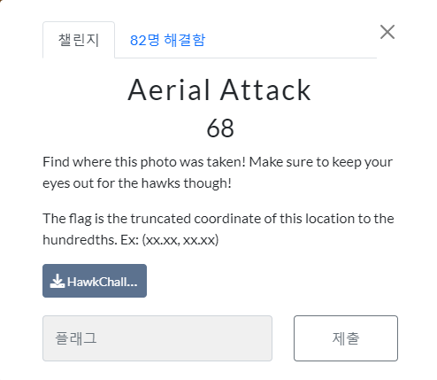
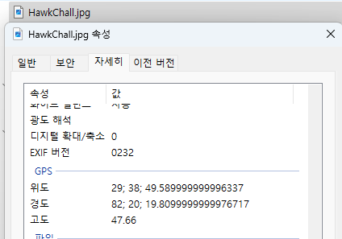
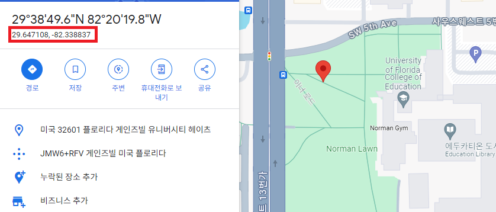

# [OSINT] Aerial Attack

>   
>
> *사진이 찍힌 위치를 찾아보라고 하고 있으며, FLAG는 이 위치의 1/100까지 잘린 좌표라고 함.*
>
> ---
>
>   
>
> ***다운로드 받은 파일의 위치를 확인해보니 경도와 위도와 표시되어 있음***
>
> * **경도 : 29도 38분 49초 6**
>
> * **위도 : 82도 20분 19초 8**
> ---
>
>   
>
> * *구글에 경도와 위도를 검색해보면 정확한 위치가 표시됨*
## Flag
>    `swampCTF{29.64, -82.33}`