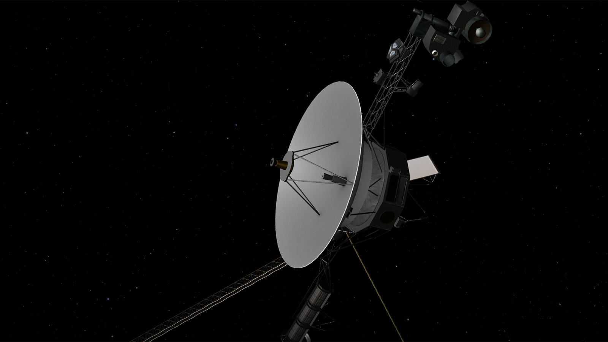
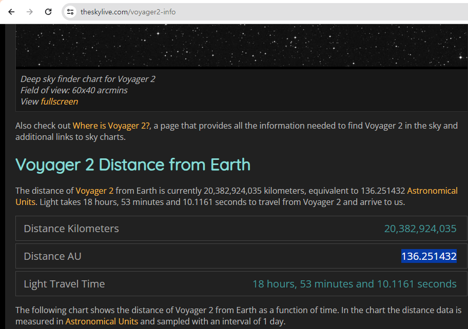

# [OSINT] Lost in Space

>   
>
> ***이미지에 있는 물체가 얼마나 멀리 떨어져있는지 알려달라고 한다.***
>
> ***Don't bother giving me the unit, there's only one that you should be using in space anyways (use Astronomical Units).***
>
> * *여러 단위를 제공할 필요가 없고, 써야할 단위는 천문단위 1개이다.*
>
> ***The Flag entry is extremely forgiving just make sure you get the integer for distance right.***
>
> * *Flag 작성방법은 매우 관대하며, 거리에 대한 정수를 올바르게 얻었는지 확인하라.*
> ---
>
>   
>
> ***theskylive.com 을 통해서 voyager2호의 위치를 확인해보면 다음과 같다.***
>
>   > ***Kilometers Units : 20,382,924,035km***
>
>   > ***Astronomical Units : 136.251432AU***
>
> * *Integer로 표현하면 136AU*
>
> ---
## Flag
>    `swampCTF{136AU}`