# [WEB] Potion Seleer

>   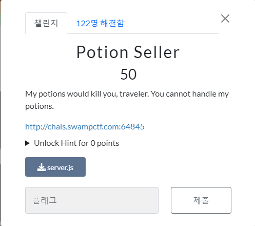
>
> * *server.js 코드를 확인*
>
> ---
>

## 문제 해석 
### *Flag 획득방법*
* *swampShade가 True로 되어있으면 /checkout 페이지로 이동시 Flag 출력*
---
### *문제 페이지 접속*
>   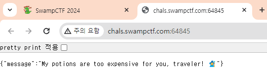
---
### *swampShade를 확인하기 위한 stats 페이지 접속*
>   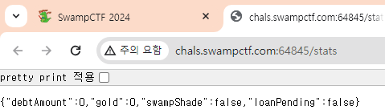
* *swampShade의 초기상태는 false로 설정*
---
### *swampShade를 true로 변경하기 위한 조건*
* */buy 부분에 아래와 같은 코드가 존재함*
```
if (potionID == 4) {
        req.session.user.swampShade = true;
    }
```
* *즉, 4번Potion을 얻게되면 swampShade가 true로 변경됨*
* *그렇다면, 4번Potion을 얻으려면 PotionList 에서 4번 Potion의 가격을 확인해야 함*
```
const potions = [
    { name: "Essence of the Abyss ⚗️", price: 10 },
    { name: "Potion of Astral Alignment ⚗️", price: 2 },
    { name: "Elixir of the Enigma ⚗️", price: 34 },
    { name: "Stardust Elixir 🧪", price: 11 },
    { name: "Swampshade Serum ⚗️", price: 100 },
    { name: "Phoenix Tears Potion ⚗️", price: 65 },
];
```
* *Potion List의 4번 Potion 가격은 100*
* *stats 상태에서도 보이지만 debtAmount 와 gold는 0이기 때문에 4번 Potion을 살 수 없으므로, 대출 필요*
* */borrow 페이지에서 대출이 가능함*
```
// Example request: http://localhost:3000/borrow?amount=1000
app.get('/borrow', (req, res) => {
    let amount = req.query.amount;
    if (req.session.user.loanPending) {
        return res.json({ message: "Repay your loan first!" });
    } else {
        // Set the loan to pending
        req.session.user.loanPending = true;
        req.session.user.debtAmount = Number(amount);
        req.session.user.gold = Number(amount);
        return res.json({ message: "You have successfully borrowed gold 🪙" });
    }
});
```
* *http://localhost:3000/borrow?amount=100 으로 URL에 amount를 4번 Potion 값으로 입력하여 대출 실행*
>   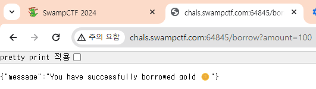
* *대출 승인 후 다시 stats 페이지에서 현재상태 확인*
>   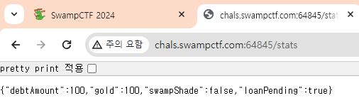
* *debtAmount 와  gold가 대출한 금액으로 변경되었으니, http://localhost:3000/buy?id=4로 4번 Potion 구매*
>   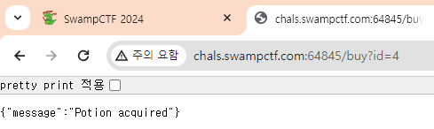
* *Potion 구매 성공이 되었으면, stats로 가서 swampShadr가 true로 변경되었는지 변경 필요*
>   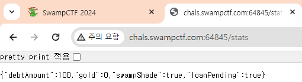
* *swampShadr가 true로 변경되었으니, /checkout가서 FLAG을 확인하면 되지만 오류발생*
* *실행한 대출을 상환하지 않아서 대출이 아직 존재한다고 에러를 발생시킴*
>   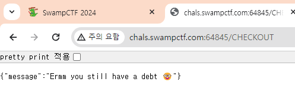
```
app.get('/checkout', (req, res) => {
    // Check if user has a pending loan
    if (req.session.user.loanPending) {
        return res.json({ message: "Ermm you still have a debt 🤓" });
    }
});
```
* *대출 상환여부를 확인하는 것이 stats에서 확인가능한 "loanPending" 값*
* *즉, loanPending 값을 false로 바꿔야 함*
* *단, 이미 Potion을 구매했기 때문에, gold가 남아있지 않아서 대출 상환이 불가능함"*
* */repay?amount=100 을 했다면 돈이 없다는 에러가 발생함*
* */repay를 실행하여 대출을 상환하려면 아래 4개의 IF 구문을 통과해야 함*

```
// Example request: http://localhost:3000/repay?amount=1000
app.get('/repay', checkUserSession, (req, res) => {

    if (!req.session.user.loanPending) {
        return res.json({ message: "You do not have any debts" });
    }

    if (!verifyAmount(amount)) {
        return res.json({ message: "Invalid amount" });
    }

    if (req.session.user.gold < Number(amount)) {
        return res.json({ message: "You don't have that much money" });
    }

    if (req.session.user.debtAmount <= Number(amount)) {
        return res.json({ message: "This is not enough to repay the debt" });
    }

    req.session.user.gold = 0;
    req.session.user.debtAmount = 0;
    req.session.user.loanPending = false;

    return res.json({ message: "✨ Debt Repaid ✨" });
});
```
* *대출 상환을 하기위해서는 loanPending이 False로 되어있어야 하는 첫번째 IF구문은*
    * *stats를 확인해보면 만족했기 때문에 Clear*
* *입력한 amount가 verifyAmount 함수를 통해서 비어있거나, 1보다 커야만 True가 발생하면서 다음 IF문으로 넘어갈 수 있음*
```
function verifyAmount(gold) {
    gold = parseInt(gold);
    if (isNaN(gold) || gold < 1) {
        return false;
    }
    return true;
}
```
* *stats에서 사용자가 보유한 gold가 Number(amount) 보다 커야만 4번째 IF문으로 넘어갈 수 있음*
* *마지막으로 debtAmount가 Number(amount) 보다 작거나 같아야만 대출 상환이 완료*
* *여기서 Hint는 VerifyAmount(gold)를 처리하는 parsetInt와 Number(amount)*
* *두개 모두, URL에 get으로 값을 넘길 때 정수가 아닌 ASCII 값(16진수)으로 넘기면 인코딩이 되면서 숫자가 변경된다는 점*
>   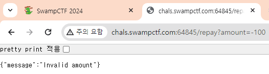
* *-100 이라는 값을 넣었을 떄 verifyAmount가 False를 발생시켜서 Invalid Amount 출력*
>   
* *입력값 : 0x2d100*
    * *0x2d = ASCII(-) / 100*
    * *ParseInt(0x2d100)은 16진수로 인식 // ParseInt(0x2d100) =>184,576*
        * *즉, ParseInt의 값은 184,576으로 비어있지 않고, 1보다 크므로 True 되어 3번째 if문 통과*
    * *Number(0x2d100)은 16진수로 인식 // Number(0x2d100) =>184,576*
        * *즉, Number(amount) 값도 184,576이지만 user.gold 보다 큰 값이므로 You don't have that much money 출력*

* *
>   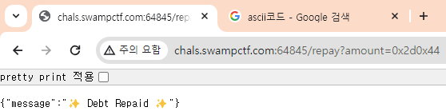
* *입력값 : 0x2d0x44*
    * *0x2d = ASCII(-) / 0x44 = ASCII(100)*
    * *ParseInt(0x2d0x44)은 16진수로 인식 // ParseInt(0x2d0x44) =>2*
        * *즉, ParseInt의 값은 2로 비어있지 않고, 1보다 크므로 True 되어 3번째 if문 통과*
    * *Number(0x2d0x44)은 16진수로 인식 // Number(0x2d0x44) =>NaN*
        * *즉, Number(amount) 값은 NaN으로 debt.Amount <= Number(amount) 에서 100 <= Nan에 해당되지 않으므로 4번째 If문 통과*

* *모든 If문을 통과하였으니, request.session.user.gold를 0으로 설정*
* *모든 If문을 통과하였으니, request.session.user.debtAmount를 0으로 설정*
* *모든 If문을 통과하였으니, request.session.user.loanPending을 0으로 설정*
* *이후 stats 페이지로 이동하여 loanPending이 변경되었는지 확인*
>   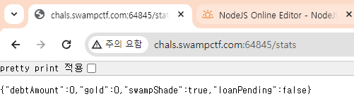
* *이제 /checkout으로 이동하여 FLAG 값 확인*
>   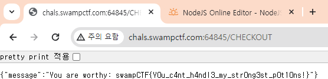

## Code
### Global Environment
```
const express = require('express');
const session = require('express-session');
require('dotenv').config();

const app = express();
const port = 3000;

const FLAG = process.env.FLAG;
app.use(session({
    secret: process.env.SESSION_SECRET,
    resave: false,
    saveUninitialized: true,
    cookie: { maxAge: 24 * 60 * 60 * 1000 } // 24 hours
}));

app.listen(port, () => {
    console.log(`App listening at http://localhost:${port}`);
});
```
---
### CheckUserSession 함수
```

// Middleware to check if user session exists
const checkUserSession = (req, res, next) => {
    if (!req.session.user) {
        req.session.user = {
            debtAmount: 0,
            gold: 0,
            swampShade: false,
            loanPending: false
        };
    }
    next();
};
app.use(checkUserSession);
```
---
### VerifyAmount 함수
```
function verifyAmount(gold) {
    gold = parseInt(gold);
    if (isNaN(gold) || gold < 1) {
        return false;
    }
    return true;
}
```
---
### Potion List 
```
// Map Potion ID to Name and Price
const potions = [
    { name: "Essence of the Abyss ⚗️", price: 10 },
    { name: "Potion of Astral Alignment ⚗️", price: 2 },
    { name: "Elixir of the Enigma ⚗️", price: 34 },
    { name: "Stardust Elixir 🧪", price: 11 },
    { name: "Swampshade Serum ⚗️", price: 100 },
    { name: "Phoenix Tears Potion ⚗️", price: 65 },
];
```
---

### /stats Page 
```
app.get('/stats', (req, res) => {
    // Show current stats
    res.json({
        debtAmount: req.session.user.debtAmount,
        gold: req.session.user.gold,
        swampShade: req.session.user.swampShade,
        loanPending: req.session.user.loanPending
    });
});
```
---
### /checkout Page 
```
app.get('/checkout', (req, res) => {
    // Check if user has a pending loan
    if (req.session.user.loanPending) {
        return res.json({ message: "Ermm you still have a debt 🤓" });
    }

    // Set the loan to pending
    if (req.session.user.swampShade) {
        return res.json({ message: "You are worthy: " + FLAG });
    }
    else {
        return res.json({ message: "You don't possess the SwampShade potion!" });
    }
});
```
---
### /borrow Page 
```
// Example request: http://localhost:3000/borrow?amount=1000
app.get('/borrow', (req, res) => {
    let amount = req.query.amount;
    // Check if request is a number
    if (!verifyAmount(amount)) {
        return res.json({ message: "Invalid amount" });
    }

    if (req.session.user.loanPending) {
        return res.json({ message: "Repay your loan first!" });
    } else {
        // Set the loan to pending
        req.session.user.loanPending = true;
        req.session.user.debtAmount = Number(amount);
        req.session.user.gold = Number(amount);
        return res.json({ message: "You have successfully borrowed gold 🪙" });
    }

});
```
---
### /buy Page
```
// Example request: http://localhost:3000/buy?id=1
app.get('/buy', (req, res) => {
    potionID = req.query.id;
    // Check if potion ID is valid
    if (!potionID || !potions[potionID]) {
        return res.json({ message: "Invalid potion ID" });
    }

    // Buy the potion
    if (req.session.user.gold < potions[potionID].price) {
        return res.json({ message: "Not enough gold" });
    }

    // Update user's stats
    req.session.user.gold -= potions[potionID].price;
    // SwampShade Serum
    if (potionID == 4) {
        req.session.user.swampShade = true;
    }
    return res.json({ message: "Potion acquired" });
});
```
---
### /repay Page 
```
// Example request: http://localhost:3000/repay?amount=1000
app.get('/repay', checkUserSession, (req, res) => {

    // Get the amount to be repayed
    let amount = req.query.amount;

    // Check if user has a pending loan
    if (!req.session.user.loanPending) {
        return res.json({ message: "You do not have any debts" });
    }

    // Check if request is a number
    if (!verifyAmount(amount)) {
        return res.json({ message: "Invalid amount" });
    }

    // If the amount is a number, check if it's enough to repay the loan
    if (req.session.user.gold < Number(amount)) {
        return res.json({ message: "You don't have that much money" });
    }

    // Check if the amount is enough to repay the loan
    if (req.session.user.debtAmount <= Number(amount)) {
        return res.json({ message: "This is not enough to repay the debt" });
    }

    // Repay the loan
    req.session.user.gold = 0;
    req.session.user.debtAmount = 0;
    req.session.user.loanPending = false;

    return res.json({ message: "✨ Debt Repaid ✨" });
});
```
---
### /Main Page 
```
app.get('/', (req, res) => {
    res.json({ message: "My potions are too expensive for you, traveler! 🧙" });
});
```

## Flag
>    `swampCTF{Y0u_c4nt_h4ndl3_my_str0ng3st_p0t10ns!}`


