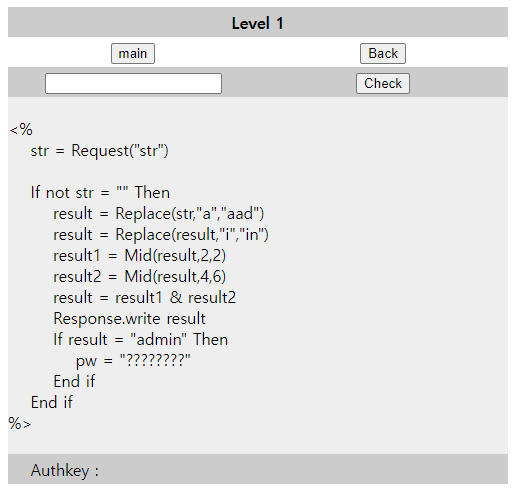
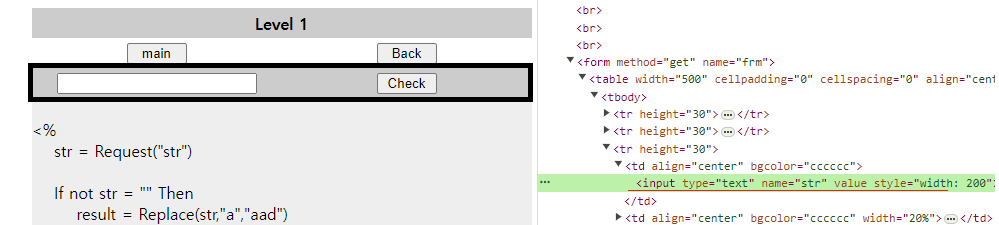

# Sunintas Challenge_1


>    
---
## 문제 풀이 
>   

* 사용자가 입력한 값은 `Request("str")`에 의해서 str 변수에 저장
* 아래 코드에 대해 해석을 하면
* 3번 명령의 결과 ( result1= _ O O _ _ _ _ _ _)
* 4번 명령의 결과 ( result2= _ _ _ O O O O O O)
* result1 & resut2를 하면 ( result = X O O O O O O O O )
* result1이 2~3까지 / result2가 4~9 까지 이므로 1번(X) 자리는 필요하지 않음


## 정답
    ami

## 정답을 넣은 문제풀이
```
사용자가 입력한 값이 NULL이 아닐 때 if구문 안으로 실행 
if not str = "" Then

    # ami => aadmi 로 변경되어 result에 저장
    result = Replace(str,"a","aad")

    # aadmi => aadmin 로 변경되어  result에 저장
    result = Replace(result,"i", "in")

    # aadmin의 2~3(ad)를 잘라서 result1에 저장
    result1 = Mid(result,2,2)

    # aadmin의 4~6(min)을 잘라서 result2에 저장
    result2 = Mid(result,4,6)

    # result1 변수와 result2를 병합 (ad&min) => (admin)
    result = result1 & result2

    # 사용자가 요청(Request) 에 대한 응답(Response) 으로 result가 admin이 되는지 확인
    Response.write result
    If result = "admin" Then

        # result는 admin 이므로 pw에 Flag값이 저장되고 
        # Flag는 이후 AuthKey에 출력 
        pw = "?????????"
    End If
End If
```